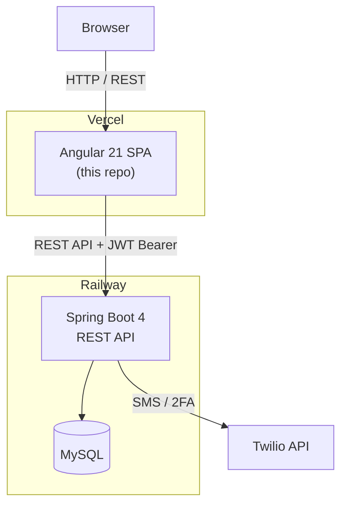

# TechBridge Invoice — Frontend

An Angular 21 invoice and customer management application built for a technology donation platform. This repository contains the **frontend** single-page application.

> **Backend (Spring Boot):** [https://github.com/ting11222001/TechBridge-Invoice](https://github.com/ting11222001/TechBridge-Invoice)

---

## Features

### Authentication & Security
- JWT-based login with access token + refresh token
- Multi-Factor Authentication (MFA) via Twilio SMS
- Account email verification
- Password reset via email link
- Automatic token refresh (HTTP interceptor)
- Route guards to protect authenticated pages

### User Management
- User registration and login
- Profile management — name, email, phone, title, bio, avatar
- Password change

### Customer Management
- Paginated customer list
- Customer search

### Invoice Management
- Create invoices and associate them with customers
- View invoice details and status
- Paginated invoice list

### Dashboard
- Statistics overview: total customers, total invoices, total billed amount

---

## Tech Stack

| Layer | Technology |
|---|---|
| Framework | Angular 21 (standalone components) |
| Styling | Bootstrap 5 |
| Reactive | RxJS 7 |
| Auth | @auth0/angular-jwt |
| Language | TypeScript 5 |
| Testing | Vitest |
| Build | Angular CLI 21 |

---

## Architecture



**Request flow:**
1. User logs in → Angular sends credentials to Spring Boot
2. Backend validates and returns JWT access + refresh tokens
3. Angular stores tokens in `localStorage`; the HTTP interceptor attaches `Authorization: Bearer <token>` to every subsequent request
4. On 401 response, the interceptor automatically refreshes the token and retries the original request

---

## Project Structure

```
src/app/
├── component/
│   ├── home/           # Dashboard + customer list
│   ├── login/          # Login + MFA verification
│   ├── register/       # User registration
│   ├── profile/        # User profile management
│   ├── customers/      # Customer management
│   ├── resetpassword/  # Password reset
│   ├── verify/         # Account & password link verification
│   ├── navbar/         # Top navigation bar
│   └── stats/          # Statistics display widget
├── service/
│   ├── user.ts         # Auth, profile, token management
│   └── customer.ts     # Customer list API calls
├── interface/          # TypeScript interfaces (User, Customer, Invoice, Stats…)
├── interceptor/        # JWT token interceptor (attach + auto-refresh)
├── enum/               # App enumerations
└── authentication-guard.ts  # Route guard
```

---

## Getting Started

### Prerequisites
- Node.js 20+
- Angular CLI 21: `npm install -g @angular/cli`
- Backend running locally or pointed at Railway (see environment config)

### Local Development

```bash
# Clone the repo
git clone https://github.com/ting11222001/techbridge-invoice-app.git
cd techbridge-invoice-app

# Install dependencies
npm install

# Start the dev server (connects to localhost:8080 by default)
ng serve
```

Open [http://localhost:4200](http://localhost:4200) in your browser.

### Environment Configuration

| File | API URL |
|---|---|
| `src/environments/environment.ts` | `http://localhost:8080` |
| `src/environments/environment.prod.ts` | `https://techbridge-invoice-production.up.railway.app` |

### Commands

```bash
ng serve       # Dev server with hot reload
ng build       # Production build → dist/
ng test        # Run unit tests with Vitest
```

---

## Deployment

| Service | Platform |
|---|---|
| Frontend | [Vercel](https://vercel.com) |
| Backend | [Railway](https://railway.app) |
| Database | MySQL on Railway |
