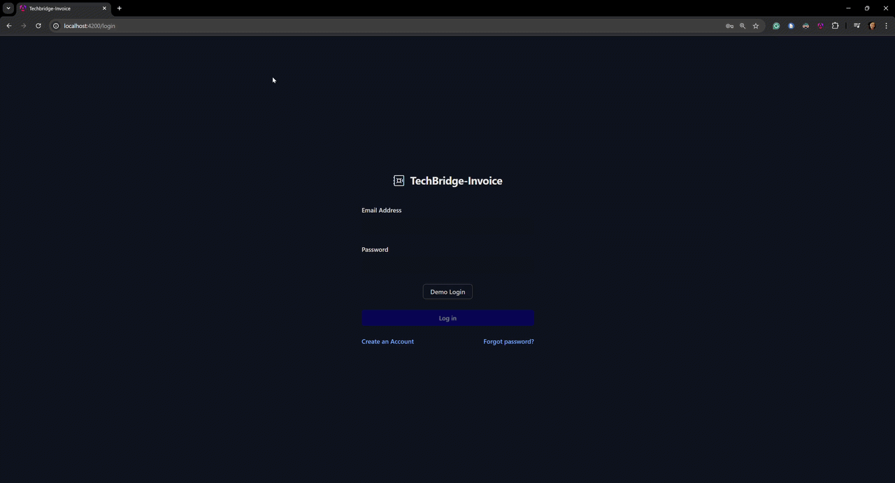

# TechBridge Invoice

> Full-stack invoicing module for a technology donation non-profit. Internal staff accounts are managed with role-based access control — admins can create and update records, coordinators can view and update, assistants are read-only. Built with Angular, Spring Boot, and JWT auth.

[Live Demo (in progress)](#) · [Backend Repo](https://github.com/ting11222001/TechBridge-Invoice) · [Demo Video (in progress)](#)

<!-- --- -->

## Table of Contents

- [Demo](#demo)
- [What's Built](#whats-built)
- [The TechBridge Story](#the-techbridge-story)
- [Tech Stack](#tech-stack)
- [Architecture](#architecture)
- [Login Flow](#login-flow)
- [Engineering Highlights](#engineering-highlights)
- [Getting Started](#getting-started)
- [What's Next](#whats-next)

<!-- --- -->

## Demo



<!-- --- -->

## What's Built

| Done | Planned |
|---|---|
| JWT login + MFA via SMS | Register + email verification |
| Token interceptor (auto-attach + 401 refresh) | Password reset via email |
| Logout | Account activity log |
| User profile — update info | Update avatar |
| Dashboard stats overview | Stats charts |
| Customer list with search + pagination | Excel export |
| Add / manage customers | Sortable columns |
| Customer status badges | Form validation |
| Invoice list with pagination | Excel export |
| Create new invoices | |
| Download invoice as PDF | |

<!-- --- -->

## The TechBridge Story

TechBridge is a non-profit that coordinates device donations from businesses to students in need. It connects three types of partner organisations — each with a financial relationship with TechBridge that needs to be tracked:

| Partner Type | Who they are | Why TechBridge invoices them |
|---|---|---|
| **Business Donor** | Companies donating end-of-life devices (e.g. Optus, Telstra) | Annual membership fee + tax receipt package |
| **Refurb Partner** | IT recyclers who wipe and refurbish devices | Annual verified partner listing fee |
| **Request Partner** | Schools and NGOs receiving devices | Annual registration fee to submit device requests |

TechBridge Invoice gives program admins a single place to manage these partner organisations, issue invoices, track payment status, and export financial records for compliance reporting.

**Roles:** `ROLE_USER` (view) → `ROLE_MANAGER` (view + update) → `ROLE_ADMIN` (full except delete) → `ROLE_SYSADMIN` (full). Full permission table in [docs/NOTES.md](docs/NOTES.md).

> This project explores the invoicing module as a focused standalone build. The full TechBridge platform — device lifecycle, donor/partner portals, allocation tracking — is being built separately with ASP.NET Core + React, informed by the patterns learned here.

<!-- --- -->

## Tech Stack

| Layer | Technology |
|---|---|
| Frontend | Angular 21, Tailwind CSS 4 |
| Backend | Spring Boot 4.0.2 (Java 17), Spring Security, Lombok |
| Auth | JWT (auth0 java-jwt), Twilio MFA/SMS |
| Database | MySQL 8.0 |
| Deploy | Vercel (frontend), Railway (backend + DB) |

<!-- --- -->

## Architecture

**Frontend**

```
Browser
  └── Angular Components
      └── Services (CustomerService, UserService)
          └── HTTP Interceptors (attach JWT, handle 401 refresh)
              └── HTTP Request to Backend
```

**Backend**

```
HTTP Request
  └── Spring Security Filters (JWT validation, permission check)
      └── REST Controllers
          └── Services
              └── Repositories (JPA + JDBC)
                  └── MySQL DB
```

**Infrastructure**

```
Local:       Docker → MySQL Container
Production:  Vercel (Frontend) + Railway (Backend + MySQL)
```

See [docs/ARCHITECTURE.md](docs/ARCHITECTURE.md) for deeper system design notes.

<!-- --- -->

## Login Flow

```
User submits credentials
  └── Backend validates email + password
      └── If MFA enabled: Twilio sends SMS code
          └── User submits SMS code
              └── Backend issues Access Token + Refresh Token
                  └── Angular stores both in localStorage
                      └── Token Interceptor attaches Access Token to every request
                          └── On 401: Interceptor silently refreshes → retries original request
```

On the backend, Spring Security routes login through `UsernamePasswordAuthenticationFilter` → `DaoAuthenticationProvider` → `UserDetailsService`. A custom `CustomAuthorizationFilter` validates the JWT on every protected request.

<!-- --- -->

## Engineering Highlights

**Type Safety**
- `CustomHttpResponse<T>` — generic wrapper gives every API response a consistent typed shape
- `DataState { LOADING, LOADED, ERROR }` — state machine enum makes every UI state explicit and exhaustive
- `Key.TOKEN` enum constants — prevents typos in localStorage keys

**Architecture**
- HTTP Interceptor — JWT injection and 401 refresh in one place; no component handles auth
- Route Guard — `authentication-guard.ts` centralises all access control
- Shell Layout Pattern — `shell.ts` wraps all authenticated routes (navbar + router-outlet) once, not per page
- Standalone Components — each component declares its own imports; no shared NgModule
- Functional Interceptor (`HttpInterceptorFn`) — uses `inject()` in a plain function, avoiding class boilerplate

**RxJS**
- `.pipe(map, catchError, startWith)` — keeps async logic declarative and readable
- `switchMap` — route param changes cancel in-flight requests automatically
- `startWith` — guarantees a loading state before the HTTP call resolves; no blank flashes

**State Management**
- Angular Signals — `currentPage = signal<number>(0)` for simple local UI state without RxJS overhead
- Stale-while-loading — `startWith({ dataState: LOADED, appData: this.data() })` shows the previous page while the next loads
- Immutable updates — `{ ...response, data: { ...response.data } }` preserves unchanged state fields

**Code Quality**
- Centralised `handleError` reused across all service methods
- `environment.apiUrl` — one change switches between dev and prod
- Guards applied once at the shell level, not duplicated per route

<!-- --- -->

## Getting Started

**Prerequisites:** Node.js 20+, Angular CLI 21

```bash
git clone https://github.com/your-username/techbridge-invoice-frontend
cd techbridge-invoice-frontend
npm install
ng serve
```

Opens at `http://localhost:4200`. Point `src/environments/environment.ts` at a local or deployed backend.

> Backend setup (IntelliJ env vars, Docker DB config) is in the [backend repo](https://github.com/ting11222001/TechBridge-Invoice).

**Demo credentials** (MFA disabled):

```
admin@gmail.com   /  Demo@2026
tiffany@gmail.com /  123456
```

See [docs/DEPLOYMENT.md](docs/DEPLOYMENT.md) for full Railway + Vercel setup and DB seeding.

<!-- --- -->

## What's Next

| Done | Planned |
|---|---|
| | Sortable table columns + form validation |
| | Stats charts on dashboard |
| | Reactive Forms (replace `ngForm`) |
| | Refactor components to Angular Signals |
| | Cloudinary avatar upload + real mock data seeding |
| | Remove Twilio SMS dependency (simplify demo auth) |
| | GitHub Actions CI/CD pipeline |
| | Full Vercel + Railway deployment docs with DB seeding |
| | Database indexing for query performance |
| | Explore gRPC or jOOQ on the backend |